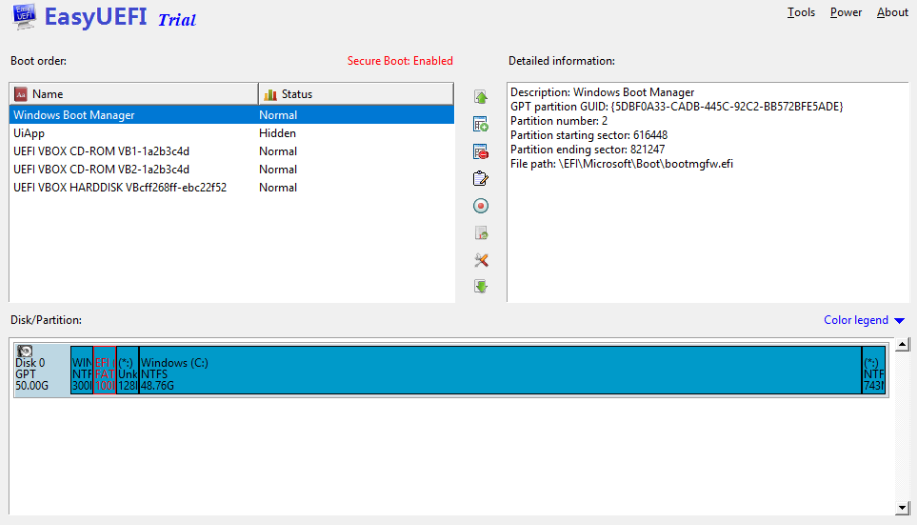
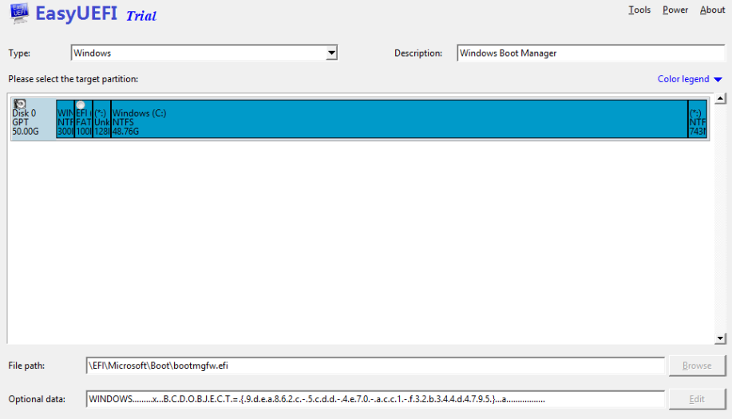
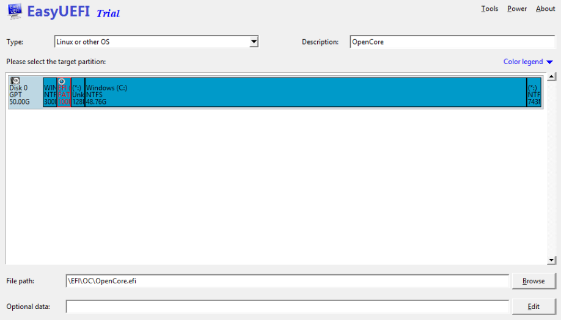

# Moving OpenCore from USB to macOS Drive

## Grabbing OpenCore off the USB

So to start, we'll first want to grab OpenCore off of our installer. To do this, we'll be using a neat tool from CorpNewt called [MountEFI](https://github.com/corpnewt/MountEFI)

For this example, we'll assume your USB is called `Install macOS Catalina`:


Once the EFI's mounted, we'll want to grab our EFI folder on there and keep in a safe place. We'll then want to **eject the USB drive's EFI** as having multiple EFI's mounted can confuse macOS sometimes, best practice is to keep only 1 EFI mounted at a time(you can eject just the EFI, the drive itself doesn't need to be removed)

**Note**: Installers made with gibMacOS's MakeInstall.bat on Windows will default to a Master Boot Record(MBR) partition map, this means there is no dedicated EFI partition instead being the `BOOT` partition that mounts by default in macOS.


Now with this done, lets mount our macOS drive. With macOS Catalina, macOS is actually partitioned into 2 volumes: System Partition and User Partition. This means that MountEFI may report multiple drives in it's picker but each partition will still share the same EFI(The UEFI spec only allows for 1 EFI per drive). You can tell if it's the same drive with disk**X**sY (Y is just to say what partition it is)


When you mount your main drive's EFI, you may be greeted with a folder called `APPLE`, this is used for updating the firmware on real Macs but has no effect on our hardware. You can wipe everything on the EFI partition and replace it with the one found on your USB

::: danger

If you want to multiboot macOS with `${otherOS}` and `${otherOS}`'s already installed, do NOT erase anything if you aren't 100% sure it isn't being used by any OS, as it can BREAK `${otherOS}`'s booting until you fix it manually. If you want to multiboot two systems (and `${otherOS}` is already installed), follow the next section.

:::

## If OpenCore doesn't appear in your boot menu

Either if you already have `${otherOS}` in your ESP partition or not, OpenCore may not appear at first on your boot menu. This is because it isn't registered in your NVRAM. As there isn't any program to do this on macOS, we'll have to do it in Windows or Linux.

### In Windows

If you don't have it already in your drive, we don't recommend using it, as there isn't any live CD to use this. If this is your case, use a Linux Live CD (like Mint) for this.

There are many apps to do this, but I'll use `Hasleo EasyUEFI` for this, as I believe it's the most reliable.

* Download EasyUEFI and install it as any application. For this, the Free Trial will work, **so don't spend 30 bucks for the paid version.**

* Once in the program, select "Manage EFI Boot Option". You'll be greated with something like this



* Click the second icon between "Boot order" and "Detailed information".



* First, select your EFI partition under "Please select the target partition". Under Type, select `Linux or other OS`. In Description, type what you want the entry to be named, for example `OpenCore`. In File path, click Browse and select your `OpenCore.efi`. Nothing is needed to be put in Optional data. After filling everything, it should look like this.



* Click OK. Reboot to your boot menu and you should have an OpenCore entry. Boot it and make sure macOS boots.

### In Linux

In Linux this is ten times easier. We'll want to use efibootmgr. Depending on your Linux distro, its installing process is different. For example, let's use Debian-based ones.

```sh
sudo apt update
sudo apt install efibootmgr
```

Once we downloaded efibootmgr, run it and you'll get an output like this:

```sh
BootCurrent: 0000
Timeout: 2 seconds
BootOrder: 0000,000C,000B,0001,0005,0002
Boot0000* Arch Linux	HD(1,GPT,cfd8eff8-f5f6-4a68-81f6-6e29abc13a8f,0x800,0x219800)/\EFI\Arch\grubx64.efi
Boot0002  Onboard NIC	BBS(Network,IBA CL Slot 00FE v0112,0x0)0000424f
Boot0005  CD/DVD/CD-RW Drive	BBS(CDROM,CD/DVD/CD-RW Drive,0x0)0000424f
```

We'll notice there isn't any OpenCore entry. First, make sure which drive and partition we are talking about by running `lsblk`. Then, to create your entry, just run this command:

```sh
sudo efibootmgr -c -d /dev/sdX -p Y -L "OpenCore" -l "\path\to\OpenCore.efi"
```
Replace `/dev/sdX` with the drive you're working with and `Y` with the number of your ESP partition (and obviously \path\to\OpenCore.efi with the real path to OpenCore.efi in your partition). Once you finish, you should get an output like before, but adding an OpenCore entry. Reboot to your boot menu and you should have an OpenCore entry. Boot it and make sure macOS boots.

## Special notes for legacy users

When transferring over your EFI, there are still boot sectors that need to be written to so your non-UEFI BIOS would be able to find it. So don't forget to rerun the [`BootInstallARCH.tool`](https://dortania.github.io/OpenCore-Install-Guide/installer-guide/mac-install.html#legacy-setup) on your macOS drive.
